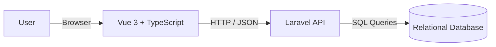
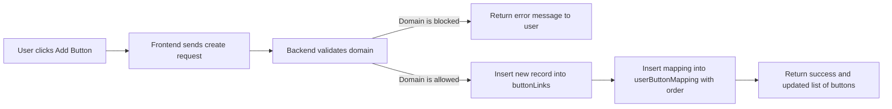
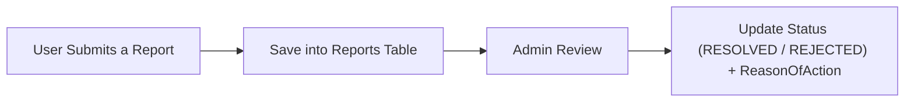

# Social-Links-Page

## Introduction
Social links page is a web application made using Vue3 TS + Laravel, Social links page is about a tool that helps user to make a web page of their own that contains desired links of their social media, users can login into there account through a login process or they can make one in case they were new, the Scoial links page of the user is managed through a dashboard, Where loaded with options for customization.

## Problem and Solution
Nowadays people have an account in almost all social medias, In networking with other people sending links separately and paragraphs that contain all the social medias can be annoying, unproffesional and inefficiant.
We provide a solution for that where users can gather all there social contacts into a single web page where it is accessable everywhere and easliy manageable through dashboard.
Sending a single link or qr code that contains all desired social medias is all you need.   


## System users
* Admin
* Normal User

## Target User
Our Targeted Users are a wide rang of people, such as Influencers, content creator, tech enthusiast and Anyone in needs for the feature.   

## Success Criteria
To determine the success of the Social Links Page project, the following measurable criteria have been established:

1. **Complete User Authentication System**
   A fully functional login and signup mechanism that securely manages user registration, authentication, and access control.
2. **Interactive Dashboard with Full CRUD Functionality**
   A responsive and intuitive dashboard that enables users to create, read, update, and delete their social media links efficiently.
3. **Publicly Accessible User Pages**
   Each user’s customized social links page must be successfully deployed and accessible through a public URL.
4. **Structured and Well-Designed Database Schema**
   A properly designed and normalized database diagram ensuring data integrity, scalability, and maintainability.
5. **Robust and Well-Documented APIs**
   The system must provide clear, secure, and reliable API endpoints for all necessary operations between the frontend and backend.

## Core Features

| ID | Feature                 | Description                                      |
| -- | ----------------------- | ------------------------------------------------ |
| F1 | User Profile Management | Create, view, update personal information        |
| F2 | Button/Links Management | Add, view, update, reorder and soft-delete links |
| F3 | Interests & Search (explore page)     | Search users via interest tags                   |
| F4 | Reporting System        | Report users for inappropriate content           |
| F5 | Domain Filtering        | Detect and block harmful domains in links        |
| F6 | Admin Privileges        | Moderation of reports & user accounts            |

## Functional Requirements  
Here we have the main functions that the Social Links Page system provides:  

**1. User Registration and Login**  
- The system allows new users to sign up using email, username and password.  
- The system allows existing users to log in securely to their dashboard.  

**2. User Profile Management**  
- The system allows users to create, view and update their personal information (name, bio, profile image, interests, etc.).  

**3. Social Buttons / Links Management**  
- The system allows users to add new social links with title, description and URL.  
- The system allows users to view all of their saved links in the dashboard.  
- The system allows users to update existing links.  
- The system allows users to soft-delete links (hide without losing data).  
- The system allows users to control the order of links using the mapping table.  

**4. Public Social Links Page**  
- The system generates a public page for each user that shows their profile and active links.  
- The system allows users to copy or share the public URL of their page.  

**5. Interests and Explore Page**  
- The system allows users to select one or more interests from a list.  
- The system allows visitors to search and discover users by interest tags on the explore page.  

**6. Reporting System**  
- The system allows users to submit a report about another user with title and description.  
- The system stores each report with its status (for example: PENDING, RESOLVED, REJECTED).  

**7. Domain Filtering**  
- The system checks each new link against the domainBlockList table.  
- The system rejects and does not save links that use blocked or harmful domains.  

**8. Admin Features**  
- The system allows admin users to view all reports.  
- The system allows admin users to update report status and add a reason of action.  
- The system allows admin users to manage user accounts (for example mark as deleted or disable access).  

**9. Security and Session Management**  
- The system uses token-based authentication between frontend and backend.  
- The system allows users to log out and invalidate their session token.  

## Non-Functional Requirements  
Here we describe the main quality requirements of the Social Links Page system:  

**1. Usability**  
- The system provides a simple and clean interface, so that users can easily understand how to sign up, login and manage their links without needing technical knowledge.  

**2. Performance**  
- The system loads the dashboard and public pages in a reasonable time, even when a user has many links.  

**3. Security**  
- The system stores passwords in a hashed form, uses secure authentication (for example token-based auth) and validates all inputs to reduce common security risks.  

**4. Reliability**  
- The system handles invalid data and unexpected errors gracefully, showing clear error messages instead of crashing.  

**5. Scalability**  
- The system is designed so that the database and Laravel backend can support growth in number of users and links without major changes.  

**6. Maintainability**  
- The system is organized in a modular way (separated frontend and backend layers) so that future developers can easily understand and extend the project.  

**7. Compatibility**  
- The system works correctly on modern web browsers and different screen sizes (desktop, tablet, mobile).  


## Architecture  
Here we describe the high-level architecture of the Social Links Page system.  

The Social Links Page is built using a classic web application architecture with three main layers:  

1. **Client Side (Frontend)**  
   - The frontend is implemented using Vue 3 with TypeScript.  
   - The frontend runs in the user’s browser and is responsible for rendering the user interface, handling form inputs and sending requests to the backend API.  
   - The frontend communicates with the backend using HTTP requests and JSON data.  

2. **Server Side (Backend)**  
   - The backend is implemented using Laravel.  
   - The backend exposes RESTful API endpoints for authentication, profile management, links management, interests, reporting and admin actions.  
   - The backend contains the application logic, input validation, domain checking and security mechanisms such as authentication and authorization.  

3. **Database Layer**  
   - The database layer is a relational database that stores all persistent data such as users, pages, themes, buttons, interests, reports and blocked domains.  
   - The backend uses database tables and relationships (as shown in the ER diagram) to retrieve and update data in a structured and consistent way.  

The overall flow is: the user interacts with the Vue 3 frontend in the browser, the frontend sends requests to the Laravel backend, and the backend reads or writes data in the database before returning responses back to the frontend.  


## ER diagram of database schema


## Database overview
Here is a quick description of the database

### `users`

This is the **central table** — everything else connects to users.

**Fields summary:**

* `id`: Primary key
* `username`, `email`, `name`, `phoneNo`: Basic user info
* `profileImage`: Blob for the user’s avatar
* `passwordHashed`: Hashed password (good security practice)
* `role`: Enum for roles (e.g., admin, user, moderator)
* `created_at`, `updated_at`: Timestamps for account tracking
* `isDeleted`, `isPremium`: Status flags
* `failedLoginAttempts`: For login security

**Purpose:** Stores all registered users and their profile data.


### `themePresets` + `userPage`

* `themePresets` defines the **available design themes** (e.g., “dark mode,” “minimalist”).
* `userPage` links each user to a chosen theme:

  * `userId` → references `users.id`
  * `themeId` → references `themePresets.id`

**Purpose:** Every user can have their own page with a selected theme.


### `buttonLinks` + `userButtonMapping`

* `buttonLinks` contains information about **link buttons** (e.g., “GitHub,” “Instagram,” “Portfolio”):

  * Fields like `title`, `description`, `icon`, `link`, `timestampOfCreation`, etc.
  * `isActive` and `isVisible` indicate the button’s state.
  * `noClicks` can track analytics.

* `userButtonMapping` connects users to their buttons:

  * `userId` → references `users.id`
  * `buttonId` → references `buttonLinks.id`
  * `order` defines the button’s display sequence.

**Purpose:** Users can add, reorder, and manage multiple social buttons on their page.


### `reports`

Handles **user reporting system**, allowing reports on inappropriate users or content.

**Fields summary:**

* `emailOfReporter`: who submitted the report
* `reportedOnUser`: which user is being reported (linked to `users.id`)
* `title`, `description`: details about the issue
* `reportTypeId`: type/category of report
* `reportStatus`, `handledBy`, `reasonOfAction`: for admin moderation

**Purpose:** Supports community moderation and admin action tracking.


### `domainBlockList`

Contains **blocked domains**, likely to prevent users from linking to harmful or blacklisted websites.

**Purpose:** Used for link safety checks before allowing users to add a button link.


### `interests` + `userInterestMapping`

* `interests` lists all possible interest categories (e.g., “Technology,” “Design,” “Travel”).
* `userInterestMapping` connects users with their interests:

  * `userId` → references `users.id`
  * `interestId` → references `interests.id`

**Purpose:** Lets users define their personal interests, possibly for recommendation or filtering.


### Summary of Relationships

| Relationship                            | Type        | Description                          |
| --------------------------------------- | ----------- | ------------------------------------ |
| users ↔ userPage                        | 1–1         | Each user has one page and one theme |
| users ↔ userButtonMapping ↔ buttonLinks | 1–M         | Users can have multiple links        |
| users ↔ reports                         | 1–M         | Users can be reported multiple times |
| users ↔ userInterestMapping ↔ interests | M–M         | Users can have multiple interests    |
| buttonLinks ↔ domainBlockList           | –           | Used indirectly for validation       |
| themePresets                            | independent | Defines reusable themes              |


### Overall
database is **clean, modular, and scalable** — it supports:

* User profiles with theming and customization
* Personal and social link management
* Interest-based personalization
* Security via blocked domains and report handling
* Analytics (click tracking)

**In short:**
This database powers a **customizable social link page platform** where users create personal pages with buttons (links) to their social media or content, choose themes, declare interests, and where admins can handle reports and restrict unsafe domains.

## Workflow Diagrams

### Creating a Social Button

```
User Clicks Add Button → Server Receives Request → Validate Domain → Insert into buttonLinks → Insert into userButtonMapping (order)
```

### Searching Users by Interest

```
Search Input → Find Interest ID → Get Users with that Interest → Return user cards with profile info
```

### Reporting a User

```
User Submits a Report → Save into Reports Table → Admin Review → Update Status (RESOLVED / REJECTED) + ReasonOfAction
```

## Diagrams (mermaid)
Here we have some mermaid diagrams that describe the main parts and flows of the Social Links Page system.

### System Overview

### Creating a Social Button


### Reporting a User



## Methodology
Here we describe how the Social Links Page system is planned and developed:

1. Requirements and Planning  
- The team identifies the main problem, target users, system users and features such as profile management, links management, interests, reporting and domain filtering.  
- The team writes the initial README, user stories and success criteria to define what the system should do.

2. System Design  
- The team designs the database schema and ER diagram, including tables like users, userPage, themePresets, buttonLinks, userButtonMapping, interests, reports and domainBlockList.  
- The team defines main workflows such as creating a social button, searching by interest and reporting a user.  
- The team decides the overall architecture with Vue 3 + TypeScript as frontend and Laravel as backend.

3. Implementation  
- The team follows the expected time table (week 1 to week 4) to implement the backend APIs, frontend pages and integration step by step.  
- The backend team implements Laravel controllers, routes and models for authentication, links, interests, reports and admin actions.  
- The frontend team builds the Vue 3 components for login, signup, dashboard, public page and explore page, and connects them to the backend APIs.

4. Testing  
- The team tests the APIs using tools such as Postman or Thunder Client.  
- The team tests user flows manually in the browser, including sign up, login, managing links, searching by interest and reporting users.  
- The team fixes bugs and verifies that the system meets the defined user stories and success criteria.

5. Deployment and Review  
- The team deploys the backend to a cloud platform and the frontend to a hosting service.  
- The team reviews the project against the success criteria, documents limitations and lists possible future improvements.

## Limitations
Here we list the main limitations of the current version of the Social Links Page system:

1. No Advanced Analytics  
- The system does not provide detailed analytics such as visitor tracking, heatmaps or full click statistics, even though some basic fields like noClicks exist in the database.

2. No Third-Party Authentication  
- The system does not support external login providers like Google, Facebook or GitHub, so users must always register with email and password.

3. No Drag-and-Drop Reordering  
- The system does not provide a drag-and-drop interface for changing the order of links; ordering is managed using the mapping table and simple controls.

4. No Custom Domain Integration  
- The system does not allow users to connect or manage their own custom domains for their social links page.

5. No Built-In SEO Tools  
- The system does not include advanced SEO features such as meta-tag management, custom OG tags or sitemap generation for user pages.

6. No Media Hosting  
- The system does not host user media files; users can only reference external images or content through links.


## Improvements
Here we list some possible improvements and future enhancements for the Social Links Page system:

1. Add Advanced Analytics  
- The system can be improved by adding detailed analytics for each link and user page, such as total visits, click counts, and simple charts over time.

2. Support Third-Party Authentication  
- The system can be extended to allow login using external providers like Google, Facebook or GitHub, to make registration and login faster for users.

3. Drag-and-Drop Link Arrangement  
- The system can include a drag-and-drop interface in the dashboard so that users can reorder their links more easily and visually.

4. Custom Domain Support  
- The system can allow users to connect their own custom domain (for example: myname.com) to their social links page.

5. Premium Features and Monetization  
- The system can introduce premium plans with extra features such as advanced themes, detailed analytics or higher link limits, and use the existing premium flags in the database.

6. SEO and Meta-Tag Management  
- The system can provide SEO settings so that users can customize meta titles, descriptions and social preview images for their public pages.


8. Multi-Language Support  
- The system can add localization so that the interface can be used in multiple languages depending on the user’s preference.

## **Non-Goals**
To maintain focus and ensure timely delivery, the following items are explicitly out of scope for the current version of the project:

1. **Advanced Analytics and Reporting**
   The system will not include complex analytics features such as visitor tracking, heatmaps, or click statistics.
2. **Third-Party Authentication Integration**
   External login options (e.g., Google, Facebook, GitHub) will not be supported in this release.
4. **Drag-and-Drop Link Arrangement**
   Dynamic link rearrangement through drag-and-drop functionality is not included in the current scope.
5. **Custom Domain Linking**
   Users will not be able to connect personal or custom domains to their social links page.
6. **Search Engine Optimization (SEO) Tools**
   The project will not include built-in SEO or meta-tag management tools for user pages.
7. **Media Hosting Services**
   Users will not be able to upload or host images or videos directly within the platform; only external links are supported.
8. **Multi-Language Support**
   The application will only be available in English, with no immediate plan for localization.


## Expected Time Table

| Weeks | Task |
|-------|------|
| 1     | **Project Setup & Database Design**<br>• Set up Laravel backend project structure<br>• Set up Vue 3 + TypeScript frontend project<br>• Configure development environment and Git repository<br>• Create basic project documentation |
| 2     | **Authentication & Backend APIs**<br>• Implement user registration (signup) endpoint<br>• Implement login and JWT-based authentication<br>• Create CRUD API endpoints for social links management<br>• Implement logout functionality<br>• Write API documentation<br>• Conduct API testing (Postman/Thunder Client) |
| 3     | **Frontend Development & Dashboard**<br>• Build authentication pages (Login & Signup)<br>• Create user dashboard with CRUD functionality for links<br>• Implement link customization features (colors, styling)<br>• Build preview functionality for social links page<br>• Integrate frontend with backend APIs<br>• Implement responsive design |
| 4     | **Public Page & Deployment**<br>• Build public-facing social links page with unique URLs<br>• Implement copy/share URL functionality<br>• Conduct end-to-end testing and bug fixes<br>• Deploy backend to cloud platform (Heroku/Railway/AWS)<br>• Deploy frontend (Vercel/Netlify)<br>• Final documentation and project presentation preparation |

## User-Stories
Here we have **9 user stories** :

1. **As a new user**, I want to **sign up with my email and password**, so that I can **create an account and start building my social links page**.
2. **As a returning user**, I want to **log in securely to my dashboard**, so that I can **manage and edit my existing links**.
3. **As a user**, I wanna **add links to my various social media platforms**, so that **visitors can easily access all my online profiles from one page**.
4. **As a user**, I wanna **customize the appearance of my social links page (colors)**, so that **it matches my personal or brand style**.
5. **As a user**, I wanna **preview my social links page before publishing**, so that **I can ensure it looks the way I want**.
6. **As a user**, I wanna **copy or share a single public URL to my social links page**, so that **I can share all my social accounts easily with others**.
7. **As a user**, I wanna **edit or remove links from my dashboard**, so that **I can keep my page updated with my latest social media accounts**.
8. **As a user**, I wanna **log out securely**, so that **my personal data and account remain protected on shared devices**.


## Team Members 
- [Halwest Salam](https://github.com/Halwest-S)
- [Ibrahim Hemin](https://github.com/IbrahimHeminJ)
- [Mustafa Kabeer](https://github.com/Mustafa-Kabeer)
- [Suhaeb Fazel](https://github.com/SuhaebFazelMohammad)
- [Zheer Salam](https://github.com/Zheers9)


## Team Links Resources
[Our Kanban](https://trello.com/invite/b/68f2864a1d463749d57c831f/ATTIe20ffc9dde2872cde5513eea36c5bfbbBF22C3AD/social-links-page)   
[Figma design](https://www.figma.com/design/YyVY83BTaMs8ojsVnbOHZk/Social-Links-Page?node-id=0-1&t=lYUZrxpuYDuBCmtm-1)
